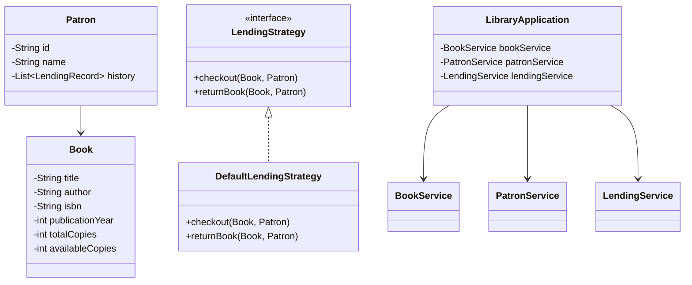

# Library Management System
Library Management System - Low-Level Design Problem
## Features

### Core Features
- **Book Management**
  - Add, remove, update books
  - Search by title, author, or ISBN
  - Track available copies
- **Patron Management**
  - Register and manage patrons
  - Track borrowing history
- **Lending Process**
  - Checkout and return books
  - Configurable lending rules
- **Inventory Management**
  - Real-time tracking of available books
  - Borrowing history

## Technical Implementation

### Design Patterns
- **Strategy Pattern**: Flexible lending rules
- **Dependency Injection**: Constructor-based service injection

### Architecture
